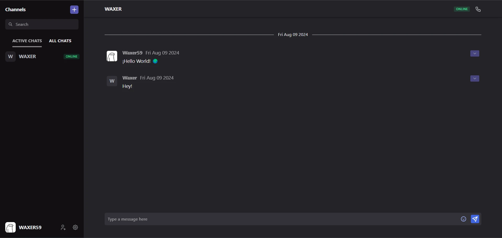

# Hear Me Out



Hearmeout is a real-time messaging platform that enables users to communicate with others within the same platform. Users can engage in private conversations or create group chats, inviting others to join their discussions. Additionally, the platform supports voice and video calls through the WebRTC API.

## How to run the project

1. Install all the dependencies.

```bash
pnpm install
```

2. Follow the steps for the [Backend](#backend) and [Frontend](#frontend).

3. Start the project with the following command:

```bash
pnpm dev
```

### Backend

1. Rename the file **.template.env** to **.env** and fill all the environment variables.

2. Open docker and run the following command to create the databases:

```bash
pnpm dev:db
```

### Frontend

1. Rename the file **.template.env** to **.env** and fill all the environment variables.

## Technologies

### Frontend

- [React](https://reactjs.org/)
- [Typescript](https://www.typescriptlang.org/)
- [React-router-dom](https://reactrouter.com/en/main)
- [Tailwindcss](https://tailwindcss.com/)
- [Tabler icons](https://tabler-icons.io/)
- [Use debounce](https://github.com/xnimorz/use-debounce#readme)
- [Emoji mart](https://missiveapp.com/open/emoji-mart)
- [Socket io](https://socket.io/)
- [Sonner](https://sonner.emilkowal.ski/)
- [Zod](https://zod.dev/)
- [Zustand](https://docs.pmnd.rs/)
- [Radix UI](https://www.radix-ui.com/)
- [React Draggable](https://www.npmjs.com/package/react-draggable)

### Backend

- [Nestjs](https://nestjs.com/)
- [Swagger](https://swagger.io)
- [Redis](https://redis.io/)
- [Redis Commander](https://github.com/joeferner/redis-commander)
- [Passport](https://www.passportjs.org/)
- [Socket io](https://socket.io/)
- [Cloudinary](https://cloudinary.com/)
- [Prisma](https://www.prisma.io/)
- [MongoDB](https://www.mongodb.com/)
- [NanoID](https://www.npmjs.com/package/nanoid/v/3.3.4)
- [Wrtc](https://www.npmjs.com/package/wrtc)
